<div align="center">
  <!-- Animated Header SVG -->
  
  
  <!-- Animated Avatar SVG -->
  
  
  <!-- GitRoll Profile Badge -->
  <a href="https://gitroll.io/profile/uWICNbCOz7Ce2PKXdjCsFMCPoMFx2" target="_blank">
    
  </a>
</div>

---

## 🚀 About Me

I'm a passionate **Full-Stack Developer** and **AI Engineer** with expertise in building modern web applications and integrating cutting-edge AI technologies. I love creating beautiful, performant, and scalable solutions that solve real-world problems.

<div align="center">
  <!-- Enhanced Snake Animation SVG -->
  
</div>

---

## 💼 Professional Profile

### 🔧 Core Expertise
- **Full-Stack Development** | **AI Integration** | **Cloud Architecture**
- **Spec-Driven Development** | **API Design** | **System Architecture**
- **3+ Years GitHub Experience** | **Version Control** | **Open Source Contribution**

### 🎯 Specializations
- Building AI-powered applications with OpenAI Agents SDK, LangChain, and CrewAI
- Developing scalable web applications with modern JavaScript/TypeScript ecosystems
- Implementing CI/CD pipelines and cloud infrastructure
- Creating responsive UI/UX designs with Figma and modern CSS frameworks

---

## 🛠️ Technical Skills

### 🌐 Frontend Development
<div align="center">
  
</div>

### ⚙️ Backend Development
<div align="center">
  
</div>

### 🤖 AI & Machine Learning
<div align="center">
  
  <br>
  <strong>AI Frameworks:</strong> OpenAI Agents SDK | LangChain | CrewAI | Hugging Face
</div>

### 🗄️ Database & CMS
<div align="center">
  
</div>

### ☁️ Cloud & DevOps
<div align="center">
  
</div>

### 🎨 Design & Tools
<div align="center">
  
  <br>
  <strong>Additional:</strong> Spec-Driven Development | Specifyplus | Prompt & Context Engineering
</div>

---

## 🎯 Tech Stack Animation

<div align="center">
  
</div>

---

## 💻 Skills Visualization

<div align="center">
  
</div>

---

## 📊 GitHub Analytics

<div align="center">
  
</div>

**🔗 GitHub Stats:** [View Stats](https://github-readme-stats.vercel.app/api?username=syed-mujtaba-stack&show_icons=true&theme=radical)

**🔗 Top Languages:** [View Languages](https://github-readme-stats.vercel.app/api/top-langs/?username=syed-mujtaba-stack&layout=compact&theme=radical)

**🔗 GitHub Streak:** [View Streak](https://streak-stats.demolab.com/?user=syed-mujtaba-stack&theme=radical)

---

## 🏆 Achievements & Badges

**🔗 GitHub Trophies:** [View Trophies](https://github-profile-trophy.vercel.app/?username=syed-mujtaba-stack&theme=radical)

---

## 📈 Activity Graph

**🔗 Activity Graph:** [View Activity](https://github-readme-activity-graph.cyclic.app/graph?username=syed-mujtaba-stack&theme=react-dark)

---

## 🌐 Connect With Me

<div align="center">
  
</div>

<div align="center">
  
  [](mailto:abbasmujtaba125@gmail.com)
  [](https://www.linkedin.com/in/syed-m-069a7a2bb/)
  [](https://www.instagram.com/m.j_syed/)
  [](https://mujtaba-abbas.web.app/)
  
</div>

---


## 🎯 Current Focus

- 🔭 Building AI-powered web applications
- 🌱 Learning advanced ML techniques and LLM optimization
- 💡 Contributing to open-source projects
- 🚀 Exploring cloud-native architectures

---

## 🌟 Featured Projects

<div align="center">
  <!-- Animated Project Cards SVG -->
  
</div>

---

## 🏅 Certifications & Achievements

<div align="center">
  <!-- Animated Achievement Badges SVG -->
  
</div>

---

## 📈 Learning Journey

<div align="center">
  <!-- Animated Learning Path SVG -->
  
</div>

---

<div align="center">
  <!-- Custom Animated Footer SVG -->
  
</div>

<div align="center">
  <strong>⚡ "Code is poetry written in logic" ⚡</strong>
  <br>
  <small><em>Built with passion, coffee, and lots of ☕</em></small>
</div>

---

## 🌟 Thank You!

<div align="center">
  <!-- Thank You Animation SVG -->
  
</div>


<!-- 🤖 Auto-Updated Tutorial on 2026-01-14 -->
## 📚 Daily Tutorial

# Python List Comprehension Example

```python
# Instead of this:
numbers = []
for num in range(1, 11):
    if num % 2 == 0:
        numbers.append(num)

# Use this elegant one-liner:
numbers = [num for num in range(1, 11) if num % 2 == 0]

# Both produce: [2, 4, 6, 8, 10]
```

Clean, readable, and Pythonic! 🐍

---


<!-- 🤖 Auto-Updated Tutorial on 2026-01-14 -->
## 📚 Daily Tutorial

# Python List Comprehension Example

```python
# Instead of this:
numbers = []
for num in range(1, 11):
    if num % 2 == 0:
        numbers.append(num)

# Use this elegant one-liner:
numbers = [num for num in range(1, 11) if num % 2 == 0]

# Both produce: [2, 4, 6, 8, 10]
```

Clean, readable, and Pythonic! 🐍

---


<!-- 🤖 Auto-Updated on 2026-01-14 -->
## 🚀 Daily Improvement

- Enhanced project structure and organization
- Updated documentation for better clarity
- Added new utility functions and examples
- Improved code comments and readability

---


<!-- 🤖 Auto-Updated Example on 2026-01-14 -->
## 💻 Code Example

# Docker Multi-Stage Build

```dockerfile
# Multi-stage build for smaller images
FROM node:18-alpine AS builder
WORKDIR /app
COPY package*.json ./
RUN npm ci --only=production

FROM node:18-alpine AS runtime
WORKDIR /app
COPY --from=builder /app/node_modules ./node_modules
COPY --from=builder /app/build ./
EXPOSE 3000
CMD ["node", "server.js"]
```

Optimized for production! 🐳

---


<!-- 🤖 Auto-Updated Tutorial on 2026-01-14 -->
## 📚 Daily Tutorial

# Quick Git Tip: Efficient Branch Management

```bash
# Create and switch to new branch
git checkout -b feature/amazing-feature

# Make your changes
git add .
git commit -m "Add amazing feature"

# Switch back to main and merge
git checkout main
git merge feature/amazing-feature

# Push changes
git push origin main
```

This helps keep your main branch clean while developing features!

---


<!-- 🤖 Auto-Updated Tutorial on 2026-01-14 -->
## 📚 Daily Tutorial

# CSS Flexbox Centering

```css
/* Center any element perfectly */
.center-perfect {
  position: absolute;
  top: 50%;
  left: 50%;
  transform: translate(-50%, -50%);
}
```

Works for any element type! 🎯

---


<!-- 🤖 Auto-Updated on 2026-01-14 -->
## 🚀 Daily Improvement

- Enhanced project structure and organization
- Updated documentation for better clarity
- Added new utility functions and examples
- Improved code comments and readability

---


<!-- 🤖 Auto-Updated Example on 2026-01-14 -->
## 💻 Code Example

# React Component Pattern

```jsx
// Reusable button component
const Button = ({ children, onClick, variant = 'primary' }) => {
  const baseClasses = 'px-4 py-2 rounded font-medium transition-colors';
  const variantClasses = variant === 'primary' 
    ? 'bg-blue-600 hover:bg-blue-700 text-white' 
    : 'bg-gray-200 hover:bg-gray-300 text-gray-800';
  
  return (
    <button 
      className={`${baseClasses} ${variantClasses}`}
      onClick={onClick}
    >
      {children}
    </button>
  );
};
```

Clean and reusable! ♻️

---


<!-- 🤖 Auto-Updated Tutorial on 2026-01-14 -->
## 📚 Daily Tutorial

# JavaScript Async/Await Pattern

```javascript
// Instead of callback hell
function fetchData() {
  return new Promise((resolve) => {
    setTimeout(() => resolve('Data loaded!'), 1000);
  });
}

// Use clean async/await
async function loadData() {
  const data = await fetchData();
  console.log(data);
}
```

Modern and maintainable! ⚡

---


<!-- 🤖 Auto-Updated on 2026-01-14 -->
## 🚀 Daily Improvement

- Enhanced project structure and organization
- Updated documentation for better clarity
- Added new utility functions and examples
- Improved code comments and readability

---


<!-- 🤖 Auto-Updated Example on 2026-01-14 -->
## 💻 Code Example

# Docker Multi-Stage Build

```dockerfile
# Multi-stage build for smaller images
FROM node:18-alpine AS builder
WORKDIR /app
COPY package*.json ./
RUN npm ci --only=production

FROM node:18-alpine AS runtime
WORKDIR /app
COPY --from=builder /app/node_modules ./node_modules
COPY --from=builder /app/build ./
EXPOSE 3000
CMD ["node", "server.js"]
```

Optimized for production! 🐳

---


<!-- 🤖 Auto-Updated Tutorial on 2026-01-14 -->
## 📚 Daily Tutorial

# Quick Git Tip: Efficient Branch Management

```bash
# Create and switch to new branch
git checkout -b feature/amazing-feature

# Make your changes
git add .
git commit -m "Add amazing feature"

# Switch back to main and merge
git checkout main
git merge feature/amazing-feature

# Push changes
git push origin main
```

This helps keep your main branch clean while developing features!

---


<!-- 🤖 Auto-Updated on 2026-01-14 -->
## 🚀 Daily Improvement

- Enhanced project structure and organization
- Updated documentation for better clarity
- Added new utility functions and examples
- Improved code comments and readability

---


<!-- 🤖 Auto-Updated Example on 2026-01-14 -->
## 💻 Code Example

# Environment Setup Script

```bash
# Create virtual environment
python -m venv venv
source venv/bin/activate  # On Mac/Linux
venv\Scripts\activate  # On Windows

# Install dependencies
pip install -r requirements.txt

# Deactivate when done
deactivate
```

Perfect for project setup! 🛠️

---


<!-- 🤖 Auto-Updated Tutorial on 2026-01-14 -->
## 📚 Daily Tutorial

# JavaScript Async/Await Pattern

```javascript
// Instead of callback hell
function fetchData() {
  return new Promise((resolve) => {
    setTimeout(() => resolve('Data loaded!'), 1000);
  });
}

// Use clean async/await
async function loadData() {
  const data = await fetchData();
  console.log(data);
}
```

Modern and maintainable! ⚡

---


<!-- 🤖 Auto-Updated on 2026-01-14 -->
## 🚀 Daily Improvement

- Enhanced project structure and organization
- Updated documentation for better clarity
- Added new utility functions and examples
- Improved code comments and readability

---


<!-- 🤖 Auto-Updated Example on 2026-01-14 -->
## 💻 Code Example

# Environment Setup Script

```bash
# Create virtual environment
python -m venv venv
source venv/bin/activate  # On Mac/Linux
venv\Scripts\activate  # On Windows

# Install dependencies
pip install -r requirements.txt

# Deactivate when done
deactivate
```

Perfect for project setup! 🛠️

---


<!-- 🤖 Auto-Updated Tutorial on 2026-01-14 -->
## 📚 Daily Tutorial

# CSS Flexbox Centering

```css
/* Center any element perfectly */
.center-perfect {
  position: absolute;
  top: 50%;
  left: 50%;
  transform: translate(-50%, -50%);
}
```

Works for any element type! 🎯

---


<!-- 🤖 Auto-Updated on 2026-01-14 -->
## 🚀 Daily Improvement

- Enhanced project structure and organization
- Updated documentation for better clarity
- Added new utility functions and examples
- Improved code comments and readability

---


<!-- 🤖 Auto-Updated Example on 2026-01-14 -->
## 💻 Code Example

# Docker Multi-Stage Build

```dockerfile
# Multi-stage build for smaller images
FROM node:18-alpine AS builder
WORKDIR /app
COPY package*.json ./
RUN npm ci --only=production

FROM node:18-alpine AS runtime
WORKDIR /app
COPY --from=builder /app/node_modules ./node_modules
COPY --from=builder /app/build ./
EXPOSE 3000
CMD ["node", "server.js"]
```

Optimized for production! 🐳

---


<!-- 🤖 Auto-Updated Tutorial on 2026-01-14 -->
## 📚 Daily Tutorial

# Quick Git Tip: Efficient Branch Management

```bash
# Create and switch to new branch
git checkout -b feature/amazing-feature

# Make your changes
git add .
git commit -m "Add amazing feature"

# Switch back to main and merge
git checkout main
git merge feature/amazing-feature

# Push changes
git push origin main
```

This helps keep your main branch clean while developing features!

---


<!-- 🤖 Auto-Updated Example on 2026-01-14 -->
## 💻 Code Example

# React Component Pattern

```jsx
// Reusable button component
const Button = ({ children, onClick, variant = 'primary' }) => {
  const baseClasses = 'px-4 py-2 rounded font-medium transition-colors';
  const variantClasses = variant === 'primary' 
    ? 'bg-blue-600 hover:bg-blue-700 text-white' 
    : 'bg-gray-200 hover:bg-gray-300 text-gray-800';
  
  return (
    <button 
      className={`${baseClasses} ${variantClasses}`}
      onClick={onClick}
    >
      {children}
    </button>
  );
};
```

Clean and reusable! ♻️

---


<!-- 🤖 Auto-Updated on 2026-01-14 -->
## 🚀 Daily Improvement

- Enhanced project structure and organization
- Updated documentation for better clarity
- Added new utility functions and examples
- Improved code comments and readability

---


<!-- 🤖 Auto-Updated on 2026-01-14 12:25:30 -->
## 🧠 Share machine learning insights

# OpenAI API Integration

```python
import openai
from typing import List

openai.api_key = 'your-api-key'

def generate_code_suggestions(prompt: str) -> str:
    response = openai.ChatCompletion.create(
        model="gpt-4",
        messages=[
            {"role": "system", "content": "You are a helpful coding assistant."},
            {"role": "user", "content": prompt}
        ],
        max_tokens=500,
        temperature=0.7
    )
    return response.choices[0].message.content

# Usage
suggestion = generate_code_suggestions("How to optimize this Python function?")
print(suggestion)
```

AI-powered code assistance! 🤖

---


<!-- 🤖 Auto-Updated on 2026-01-14 12:26:31 -->
## 💡 Provide development insights

# Docker Multi-Stage Optimization

```dockerfile
# Build stage
FROM node:18-alpine AS builder
WORKDIR /app
COPY package*.json ./
RUN npm ci --only=production && npm cache clean --force

# Production stage
FROM node:18-alpine AS production
RUN addgroup -g 1001 -S nodejs
RUN adduser -S nextjs -u 1001
WORKDIR /app
COPY --from=builder /app/node_modules ./node_modules
COPY --from=builder /app/package*.json ./
USER nextjs
EXPOSE 3000
CMD ["node", "server.js"]
```

Secure and optimized Docker images! 🐳

---


<!-- 🤖 Auto-Updated on 2026-01-14 12:29:18 -->
## 🔮 Demonstrate AI capabilities

# LangChain Agent Setup

```python
from langchain.agents import initialize_agent, Tool
from langchain.llms import OpenAI
from langchain.memory import ConversationBufferMemory

# Initialize LLM
llm = OpenAI(temperature=0)

# Define tools
tools = [
    Tool(
        name="Calculator",
        func=lambda x: eval(x),
        description="Useful for mathematical calculations"
    ),
    Tool(
        name="Search",
        func=lambda x: f"Searching for {x}",
        description="Useful for finding information"
    )
]

# Initialize agent
memory = ConversationBufferMemory(memory_key="chat_history")
agent = initialize_agent(
    tools, llm, agent="conversational-react-description", memory=memory
)

# Use agent
response = agent.run("What is 2 + 2 and then search for Python tutorials?")
```

Building intelligent agents! 🧠

---


<!-- 🤖 Auto-Updated on 2026-01-14 12:29:23 -->
## 🎓 Share coding best practices

# TypeScript Advanced Types

```typescript
// Utility types for better type safety
type Partial<T> = { [P in keyof T]?: T[P] };
type Required<T> = { [P in keyof T]-?: T[P] };
type Readonly<T> = { readonly [P in keyof T]: T[P] };

// Conditional types
type NonNullable<T> = T extends null | undefined ? never : T;
type Extract<T, U> = T extends U ? T : never;
type Exclude<T, U> = T extends U ? never : T;

// Template literal types
type EventName<T extends string> = `on${Capitalize<T>}`;
type ClickEvent = EventName<'click'>; // 'onClick'
```

Advanced TypeScript for type-safe applications! 🛡️

---


<!-- 🤖 Auto-Updated on 2026-01-15 19:15:11 -->
## 📊 Add data science tutorial

# OpenAI API Integration

```python
import openai
from typing import List

openai.api_key = 'your-api-key'

def generate_code_suggestions(prompt: str) -> str:
    response = openai.ChatCompletion.create(
        model="gpt-4",
        messages=[
            {"role": "system", "content": "You are a helpful coding assistant."},
            {"role": "user", "content": prompt}
        ],
        max_tokens=500,
        temperature=0.7
    )
    return response.choices[0].message.content

# Usage
suggestion = generate_code_suggestions("How to optimize this Python function?")
print(suggestion)
```

AI-powered code assistance! 🤖

---
