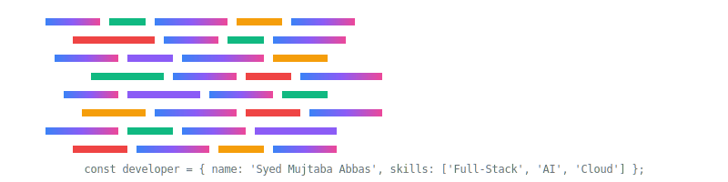

  <!-- Animated Header SVG -->
  
  
  <!-- Animated Avatar SVG -->
  
  
  <!-- GitRoll Profile Badge -->
  

---

## 🚀 About Me

I'm a passionate **Full-Stack Developer** and **AI Engineer** with expertise in building modern web applications and integrating cutting-edge AI technologies. I love creating beautiful, performant, and scalable solutions that solve real-world problems.

  <!-- Custom Animated Code Snake SVG -->
  

---

## 💼 Professional Profile

### 🔧 Core Expertise
- **Full-Stack Development** | **AI Integration** | **Cloud Architecture**
- **Spec-Driven Development** | **API Design** | **System Architecture**
- **3+ Years GitHub Experience** | **Version Control** | **Open Source Contribution**

### 🎯 Specializations
- Building AI-powered applications with OpenAI Agents SDK, LangChain, and CrewAI
- Developing scalable web applications with modern JavaScript/TypeScript ecosystems
- Implementing CI/CD pipelines and cloud infrastructure
- Creating responsive UI/UX designs with Figma and modern CSS frameworks

---

## 🛠️ Technical Skills

### 🌐 Frontend Development

  

### ⚙️ Backend Development

  

### 🤖 AI & Machine Learning

  
   
  <strong>AI Frameworks:</strong> OpenAI Agents SDK | LangChain | CrewAI | Hugging Face

### 🗄️ Database & CMS

  

### ☁️ Cloud & DevOps

  

### 🎨 Design & Tools

  
   
  <strong>Additional:</strong> Spec-Driven Development | Specifyplus | Prompt & Context Engineering

---

## 📊 GitHub Analytics

  
  

  

---

## 🏆 Achievements & Badges

  

---

## 🌐 Connect With Me

  
  
  
  
  
  

---

## 📈 Activity Graph

  

---

## 🎯 Current Focus

- 🔭 Building AI-powered web applications
- 🌱 Learning advanced ML techniques and LLM optimization
- 💡 Contributing to open-source projects
- 🚀 Exploring cloud-native architectures

---

## 🌟 Featured Projects

  <!-- Animated Project Cards SVG -->
  

---

## 🏅 Certifications & Achievements

  <!-- Animated Achievement Badges SVG -->
  

---

## 📈 Learning Journey

  <!-- Animated Learning Path SVG -->
  

---

  <!-- Custom Animated Footer SVG -->
  

  <strong>⚡ "Code is poetry written in logic" ⚡</strong>
   
  <small><em>Built with passion, coffee, and lots of ☕</em></small>

---

## 🌟 Thank You!

  <!-- Thank You Animation SVG -->
  

