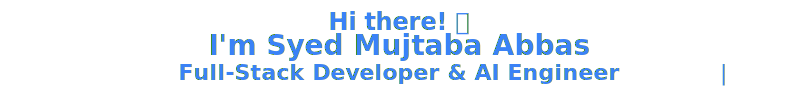

  
  
  
  

---

## 👋 About Me

I'm a **Full-Stack Developer** and **AI Engineer** with 3+ years of experience building modern web applications and integrating cutting-edge AI technologies.

### 🔧 Core Expertise
- **Full-Stack Development** | **AI Integration** | **Cloud Architecture**
- **AI Frameworks:** OpenAI Agents SDK, LangChain, CrewAI, Hugging Face
- **Tech Stack:** React, Next.js, Node.js, Python, FastAPI, PostgreSQL, Docker, AWS/GCP

---

## 🛠️ Technical Skills

  

---

## 🌐 Connect With Me

  
  
  
  

---

## 📊 GitHub Stats

  
  
  

---

  
   
  <strong>⚡ "Code is poetry written in logic" ⚡</strong>

