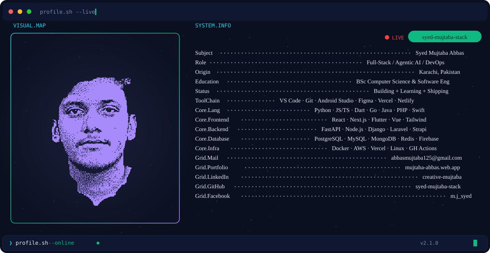

# <b>Hi 👋, I'm Syed Mujtaba Abbas</b>

<picture>
  <source media="(prefers-color-scheme: dark)" srcset="dark.svg">
  <source media="(prefers-color-scheme: light)" srcset="light.svg">
  
</picture>

---

## 🚀 About Me

> Full-Stack Developer · Agentic AI Developer · DevOps · Automation · Prompt & Context · Openclaw

- 🌍 Based in **Karachi, Pakistan**
- 🎓 Bachelors in **Computer Science & Software Engineering**
- 🌱 Currently: **Building + Learning + Shipping**
- ⚙️ ToolChain: **VS Code · Git · Android Studio · Figma · Vercel · Netlify**

## 🛠️ Languages & Tools

  
  
  
  
  
  
  
  
  
  
  
  
  

  
  
  
  
  
  
  
  
  
  

## 📊 GitHub Stats

  
  

  

## 🐍 Contribution Snake

<picture>
  <source media="(prefers-color-scheme: dark)" srcset="https://raw.githubusercontent.com/syed-mujtaba-stack/syed-mujtaba-stack/output/github-contribution-grid-snake-dark.svg">
  <source media="(prefers-color-scheme: light)" srcset="https://raw.githubusercontent.com/syed-mujtaba-stack/syed-mujtaba-stack/output/github-contribution-grid-snake.svg">
  
</picture>

## 🌐 Connect With Me

  &nbsp;&nbsp;
  &nbsp;&nbsp;
  &nbsp;&nbsp;
  &nbsp;&nbsp;
  

